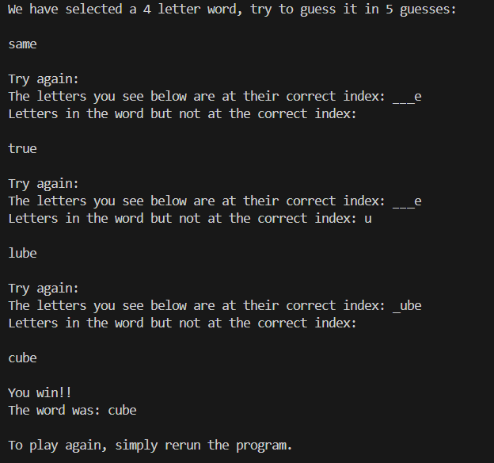

# FourWord
Word guessing game where the player has to guess a 4-letter word within 5 attempts. It's a clone of the popular Wordle game, but with 4 letters. After each guess, hints are provided to guide the player. The hints include:
1. **Correct Letters at Correct Index**: Letters that match the correct word and position.
2. **Letters in the Word But Not at the Correct Index**: Letters that exist in the word but are not at the correct position.

## Features:
- 4-letter word guessing.
- After each guess, hints are displayed:
  - Correct letters at the correct indices.
  - Letters that exist in the word but are not at the correct indices.
- Limited to 5 guesses per game.

## Prerequisites:
- **Java 8 or above** is required to run the program.

## How to Play:
1. Clone or download the repository.
2. Compile and run the `main.java` file.
3. The game will prompt you to guess a 4-letter word.
4. After each guess, the program will provide two hints:
   - Letters in the correct position.
   - Letters that are in the word but not at the correct index.
5. You have 5 guesses to win the game.
6. If you guess the word correctly, you win. If not, you’ll lose after 5 guesses.

##Demo 
--
