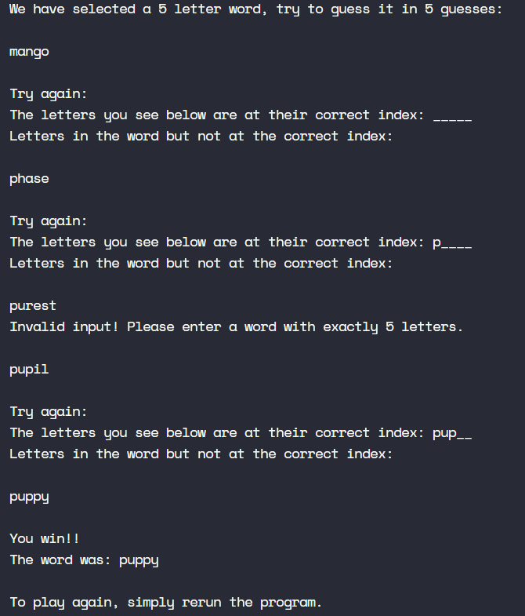

# jWordle 
A fun 5-letter word guessing game inspired by Wordle! Guess the word in 5 tries and get hints after each guess:
1. **Correct Letters at Correct Index**: Letters that match the correct word and position.
2. **Letters in the Word But Not at the Correct Index**: Letters that exist in the word but are not at the correct position.

## How to Play  
1. Download the code.  
2. Run `Main.java`.
3. Enter your 5-letter guess when prompted.  
4. Use the hints to figure out the word.  
5. You’ve got 5 guesses to win!  

## Requirements  
- Java 8 or later

